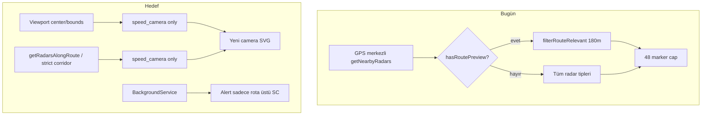

# Radar Tinder — Production, Policy, Driving Mode & Icons

## Mevcut durum

[PLANtinder.md](PLANtinder.md) doğru yönde; kodda henüz uygulanmamış parçalar:

| Alan | Durum |
|------|--------|
| Viewport → RN bridge (`onViewportChange`) | Yok — `moveend` sadece marker cluster yeniler |
| `getRouteAwareRadars` / `speed_camera`-only | Yok — `getRadarsAlongRoute` var ama kullanılmıyor |
| Rota dışı bildirim kesme | Kısmi — koridor 170–180 m, tüm radar tipleri |
| Hardcoded `$` fiyatlar | [SubscriptionScreen.tsx](src/screens/SubscriptionScreen.tsx), [TrialOfferScreen.tsx](src/screens/TrialOfferScreen.tsx) |
| i18n | Yok — sadece km/mil bölge algısı ([settingsStore.ts](src/store/settingsStore.ts)) |
| Araç ikonu | Sabit mavi nokta ([mapHtml.ts](src/mapflow-navigation-kit/src/utils/mapHtml.ts) `ensureUserMarker`) |
| ABI | `armeabi-v7a,arm64-v8a,x86,x86_64` — plan `x86` çıkarmayı öneriyor |



---

## Bölüm 1 — Google Play abonelik politikası

**Kök neden:** UI’da sabit `$19.99`, `$3.99`, `$0.99`; deneme sonrası ücret ve iptal yolu yeterince görünür değil; [TrialOfferScreen.tsx](src/screens/TrialOfferScreen.tsx) Terms/Privacy ve iptal metni yok.

### 1.1 Store fiyatlarını tek kaynak yap

Yeni yardımcı: `src/utils/subscriptionPricing.ts`

- RevenueCat `PurchasesPackage` → `product.priceString`, `currencyCode`, `subscriptionPeriod`
- Intro/trial: `product.introPrice` / `subscriptionOptions` (varsa) ile “3 gün ücretsiz” metni
- CTA butonu metni: `Subscribe for {priceString}/year` (Play cart ile aynı string)

Her iki paywall’da statik `plans.*.price` kaldırılır; offerings yüklenene kadar skeleton, hata durumunda “Price unavailable” + retry.

### 1.2 Zorunlu yasal / deneme metinleri (EN + TR)

Yeni `src/i18n/locales/en.json` ve `tr.json` — öncelik paywall + subscription yönetimi:

Örnek EN blok (her plan kartının altında ve CTA üstünde):

> **Yearly with trial:** 3-day free trial, then {yearlyPrice}/year. Auto-renews until canceled. Cancel in Google Play: Profile → Payments & subscriptions → Subscriptions, or tap Manage below. Weekly plan bills immediately at {weeklyPrice}/week.

`TrialOfferScreen` ve `SubscriptionScreen` aynı `SubscriptionLegalBlock` bileşenini kullanacak:

- Terms + Privacy linkleri ([TermsScreen](src/screens/TermsScreen.tsx), [PrivacyScreen](src/screens/PrivacyScreen.tsx))
- “Manage subscription” → `Linking.openURL('https://play.google.com/store/account/subscriptions?package=...')` (Android)
- Yearly için trial opt-in toggle (TrialOffer’da da; şu an doğrudan “Start Premium Trial” satın alıyor)

### 1.3 Profilde abonelik yönetimi

[ProfileScreen.tsx](src/screens/ProfileScreen.tsx) veya [RadarSettingsScreen.tsx](src/screens/RadarSettingsScreen.tsx):

- Aktif plan / `CustomerInfo` özeti (RevenueCat)
- “Manage / Cancel subscription” butonu
- “Restore purchases” (mevcut restore akışına bağla)

### 1.4 i18n altyapısı (EN + TR, cihaz dili)

Bağımlılıklar: `expo-localization`, `i18next`, `react-i18next`

- `src/i18n/index.ts` — `Localization.getLocales()[0]` ile `en` / `tr` seçimi, fallback `en`
- Paywall, Driving Mode, ayarlar, bildirim metinleri için string’leri taşı
- [PRODUCTION_RELEASE_CHECKLIST.md](docs/release/PRODUCTION_RELEASE_CHECKLIST.md) — Android ürün ID doğrulama maddesi ekle

---

## Bölüm 2 — Driving Mode: speed camera mantığı

PLANtinder.md ile uyumlu uygulama.

### 2.1 Viewport bridge

**[mapHtml.ts](src/mapflow-navigation-kit/src/utils/mapHtml.ts)** — `moveend` içinde:

```javascript
send('viewportChange', {
  center: { lat, lng },
  zoom,
  bounds: { north, south, east, west }
});
```

**[MapView.native.tsx](src/mapflow-navigation-kit/src/components/map/MapView.native.tsx)** + **[MapFlowNavigationScreen.tsx](src/mapflow-navigation-kit/src/MapFlowNavigationScreen.tsx)**:

- `onViewportChange?: (viewport) => void` prop

**[DriveScreen.tsx](src/screens/DriveScreen.tsx)**:

- Rota yokken (`!hasRoutePreview`): viewport merkezi + bounds ile fetch
- Debounce 400–600 ms; `moveend` tetikler
- Filtre: `type === 'speed_camera'` + bounds içinde

### 2.2 Rota modu

**[RadarService.ts](src/services/RadarService.ts)** — yeni `getRouteAwareRadars`:

```typescript
getRouteAwareRadars({
  routeCoords,
  allowedTypes: ['speed_camera'],
  maxCorridorMeters: 55,      // yan sokak kesmek için sıkı
  maxHeadingDeltaDeg: 35,
  minAheadMeters: 15,
  currentLocation, heading, speedKph,
})
```

- Rota önizleme + navigasyon: `getRadarsAlongRoute` veya bbox sample + corridor filter
- `hasRoutePreview` iken marker kaynağı bu fonksiyon; GPS-radius fallback kaldır

### 2.3 Bildirim sıkılığı

**[BackgroundService.ts](src/services/BackgroundService.ts)**:

- `routeMode`: yalnızca `speed_camera`; koridor **55 m**, heading **35°**, ETA penceresi korunur
- Rota aktifken free-drive geniş mod (`240 m`, tüm tipler) **kapalı**
- `setRouteGuidancePath` zaten [DriveScreen](src/screens/DriveScreen.tsx)’den geliyor — senkron doğrula

### 2.4 Hızlı güncelleme (sapma)

- `useNavigationTracking` off-route → `DriveScreen`’e callback veya `radarStore` flag
- Off-route: anında `refreshOverlayMarkers` (cooldown 2–3 s)
- Periyodik refresh: navigasyonda 8 s, browse modda 15 s

### 2.5 Basic + Map tek liste

`nearbyRadars` state’i hem [RadarBasicTab](src/screens/radar/components/driving/RadarBasicTab.tsx) hem Map overlay için tek kaynak; Basic’te de `speed_camera`-only filtre.

### 2.6 Yeni speed camera SVG

[mapHtml.ts](src/mapflow-navigation-kit/src/utils/mapHtml.ts) `createOverlayMarkerElement` — `kind === 'camera'` / `speed_camera`:

- Koyu harita paletine uyum: teal/cyan gövde (`#2DD4BF` / `#5EEAD4`), kırmızı ince halka, bullet-CCTV silüeti (kullanıcının paylaştığı örneklere yakın, telifsiz özgün SVG)
- 44px daire, düşük gürültü, zoom cluster ile uyumlu

---

## Bölüm 3 — Seçilebilir araç ikonları (mavi nokta yerine)

### 3.1 Ayar

**[settingsStore.ts](src/store/settingsStore.ts)**:

```typescript
vehicleMarkerId: 'classic' | 'sedan' | 'suv' | 'sport' | 'compact' | 'hatchback'
```

Persist SecureStore ile.

### 3.2 UI

**[RadarSettingsScreen.tsx](src/screens/RadarSettingsScreen.tsx)** — “Map vehicle icon” bölümü:

- 5–6 top-down / hafif perspektif SVG önizleme (grid)
- Driving başlamadan seçilebilir; sürüşte değişim anında haritaya yansır

### 3.3 Harita

**mapHtml.ts** `updateUserLocation` payload’a `vehicleMarkerId` ekle; `ensureUserMarker` içinde ID’ye göre inline SVG (heading arrow korunur).

**MapFlowNavigationScreen** — `useSettingsStore` → location bridge mesajına ekle.

---

## Bölüm 4 — Tüm telefonlar / Play cihaz kapsamı

### 4.1 ABI

**[android/gradle.properties](android/gradle.properties)**:

```
reactNativeArchitectures=armeabi-v7a,arm64-v8a
```

(`x86`, `x86_64` prod bundle’dan çıkar — emülatör için debug ayrı kalabilir)

### 4.2 Responsive layout

Odak ekranlar (küçük yükseklik / dar genişlik):

- [SubscriptionScreen.tsx](src/screens/SubscriptionScreen.tsx) — `useWindowDimensions`, `ScrollView`, `minHeight` kartları, `TAB_BAR_HEIGHT` padding
- [TrialOfferScreen.tsx](src/screens/TrialOfferScreen.tsx) — aynı pattern
- [DriveScreen.tsx](src/screens/DriveScreen.tsx) — `chromeTopOffset` küçük ekranda `insets.top + 88` gibi clamp

Mevcut [use-mobile.ts](src/hooks/use-mobile.ts) hook’u yeniden kullan.

---

## Bölüm 5 — Production AAB ve Play gönderimi

Sıra:

1. Kod + `versionCode` / `versionName` bump ([app.json](app.json) veya `android/app/build.gradle`)
2. `cd android && ./gradlew bundleRelease`
3. `bash scripts/android-verify-16kb.sh .../app-release.aab`
4. Play Console — Internal/Closed test:
   - TR ve US test hesaplarıyla satın alma: fiyat `$` değil lokal `priceString`
   - Yearly trial: legal blok + Play cart metni eşleşiyor mu
   - Manage subscription link çalışıyor mu
5. Driving smoke: no-route pan, route navigate, off-route, yan sokak bildirimi yok
6. Publishing overview → review

Checklist güncellemesi: [PRODUCTION_RELEASE_CHECKLIST.md](docs/release/PRODUCTION_RELEASE_CHECKLIST.md) — policy + ABI + i18n maddeleri.

---

## Dosya özeti (öncelik sırası)

| Öncelik | Dosyalar |
|---------|----------|
| P0 Policy | `SubscriptionScreen`, `TrialOfferScreen`, `subscriptionPricing.ts`, `SubscriptionLegalBlock`, `i18n/*`, `ProfileScreen`/`RadarSettingsScreen` |
| P0 Driving | `mapHtml.ts`, `MapView.native.tsx`, `MapFlowNavigationScreen.tsx`, `DriveScreen.tsx`, `RadarService.ts`, `BackgroundService.ts` |
| P1 UX | `settingsStore`, `RadarSettingsScreen`, camera SVG, vehicle SVGs |
| P1 Release | `android/gradle.properties`, release checklist, version bump |

---

## Test planı (manuel — review öncesi)

1. **Policy:** TR cihaz/emülatör → paywall `₺` veya yerel format; trial metni TR; Manage subscription açılıyor
2. **No route:** Adres yok, haritayı İstanbul’a kaydır → sadece speed camera ikonları, pan/zoom’da güncellenir
3. **Route:** Hedef gir → yalnız rota üstü kameralar; yan sokaktaki kamera marker yok
4. **Navigate:** Rota üstü kamera → bildirim; paralel sokak → bildirim yok
5. **Off-route:** Sapma → 2–3 s içinde marker/bildirim seti güncellenir
6. **Vehicle icon:** Ayarlardan 3 farklı ikon, haritada mavi nokta yerine görünür
7. **AAB:** `bundletool` veya Play Explorer → `arm64-v8a` + `armeabi-v7a` only
