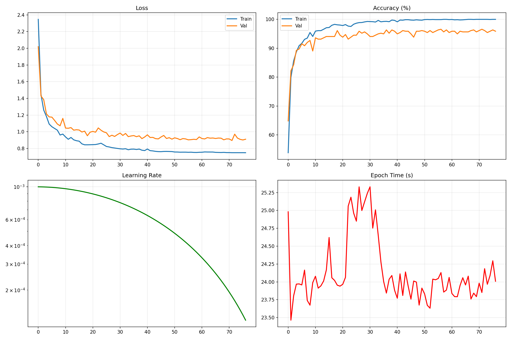

# 🚗 Vehicle Warning Lights Classifier - Complete Package

## 📦 What's This Package?

This is a **complete, standalone package** containing a trained ResNet50 model for classifying 68 types of vehicle dashboard warning lights, achieving **96.58% validation accuracy** and **94.31% test accuracy**.

You can copy this entire folder to any computer and immediately:
- ✅ Understand how the model was trained
- ✅ Run inference on new images
- ✅ Export to different formats (ONNX, TensorFlow.js)
- ✅ Retrain or fine-tune the model
- ✅ See training graphs and metrics

## 📊 Model Performance

| Metric | Value |
|--------|-------|
| **Architecture** | ResNet50 (ImageNet pretrained) |
| **Parameters** | 24.6 Million |
| **Classes** | 68 warning light types |
| **Training Samples** | 2,484 images |
| **Validation Samples** | 438 images |
| **Test Samples** | 2,093 images |
| **Best Epoch** | 57 / 77 (early stopped) |
| **Validation Accuracy** | **96.58%** ⭐ |
| **Test Accuracy** | **94.31%** ⭐ |
| **Training Time** | ~30 minutes (NVIDIA GTX 1070) |
| **Dataset Source** | Roboflow Dashboard (real photos) |

## 📁 Package Structure

```
vehicle_warning_lights_package/
├── README.md                           ← You are here
├── MODEL_ARCHITECTURE.md                ← Detailed model design
├── TRAINING_DETAILS.md                  ← How it was trained
├── USAGE_EXAMPLES.md                    ← Quick start guide
├── requirements.txt                     ← Python dependencies
│
├── model/
│   ├── best_epoch_57_acc_96.58.pth     ← PyTorch checkpoint (93.7 MB)
│   ├── warning_lights_resnet50.onnx    ← ONNX export (93.7 MB)
│   └── model_architecture.py           ← Model class definition
│
├── classes/
│   └── warning_light_classes.json      ← 68 class names (sorted)
│
├── training/
│   ├── train_resnet50.py               ← Complete training script
│   ├── dataset_loader.py               ← Data loading utilities
│   └── config.py                       ← Training configuration
│
├── inference/
│   ├── predict.py                      ← Simple inference script
│   ├── predict_batch.py                ← Batch prediction
│   ├── export_onnx.py                  ← PyTorch → ONNX converter
│   └── export_tfjs.py                  ← ONNX → TensorFlow.js
│
└── results/
    ├── training_20260103_111934.png    ← Training curves
    ├── report_20260103_111934.json     ← Detailed metrics
    └── METRICS_SUMMARY.md              ← Human-readable results
```

## 🚀 Quick Start (3 Steps)

### 1. Install Dependencies

```bash
pip install -r requirements.txt
```

**Required:**
- Python 3.8+
- PyTorch 2.0+
- torchvision
- Pillow
- numpy

**Optional (for export):**
- onnx, onnxruntime (for ONNX)
- tensorflow, tensorflowjs (for TensorFlow.js)

### 2. Run Inference

```bash
cd inference/
python predict.py --image path/to/warning_light.jpg
```

**Output:**
```
Top 3 Predictions:
  1. check_engine    - 98.5%
  2. battery         - 1.2%
  3. oil_pressure    - 0.3%
```

### 3. See Training Results

```bash
# View training graphs
open results/training_20260103_111934.png

# Read metrics
cat results/METRICS_SUMMARY.md
```

## 💡 Common Use Cases

### Classify Single Image

```python
from inference.predict import WarningLightClassifier

classifier = WarningLightClassifier()
predictions = classifier.predict("dashboard_photo.jpg", top_k=3)

for class_name, confidence in predictions:
    print(f"{class_name}: {confidence:.2f}%")
```

### Batch Processing

```python
from inference.predict_batch import batch_predict

images = ["img1.jpg", "img2.jpg", "img3.jpg"]
results = batch_predict(images, model_path="../model/best_epoch_57_acc_96.58.pth")

for result in results:
    print(f"{result['image']}: {result['class']} ({result['confidence']:.1f}%)")
```

### Export to ONNX

```bash
cd inference/
python export_onnx.py
# Output: ../model/warning_lights_resnet50.onnx
```

### Export to TensorFlow.js

```bash
cd inference/
python export_tfjs.py
# Output: ../model/tfjs_model/
```

## 🎓 Understanding The Model

### Architecture Overview

```
Input Image (224×224 RGB)
         ↓
    ResNet50 Backbone
    (ImageNet pretrained)
         ↓
     Dropout (0.3)
         ↓
   Linear (2048 → 512)
         ↓
        ReLU
         ↓
  BatchNorm1d (512)
         ↓
     Dropout (0.15)
         ↓
   Linear (512 → 68)
         ↓
  Output Logits (68 classes)
```

**See:** `MODEL_ARCHITECTURE.md` for detailed layer-by-layer breakdown

### Training Process

**Dataset:** Roboflow Dashboard Warning Lights
- **Source:** Real dashboard photos (YOLO detection crops)
- **Total Images:** 5,015
- **Train/Val/Test Split:** 2484 / 438 / 2093

**Training Configuration:**
- **Optimizer:** AdamW (lr=0.001, weight_decay=1e-4)
- **Scheduler:** Cosine Annealing
- **Loss:** CrossEntropyLoss (label_smoothing=0.1)
- **Batch Size:** 64
- **Epochs:** 77 (early stopped from 100)
- **Early Stopping:** 20 epoch patience

**Data Augmentation:**
- Random crop (256→224)
- Random horizontal flip
- Random rotation (±10°)
- Color jitter (brightness, contrast)

**Regularization:**
- Dropout: 0.3 and 0.15
- Label smoothing: 0.1
- ImageNet normalization

**See:** `TRAINING_DETAILS.md` for epoch-by-epoch analysis

## 📈 Training Results

### Learning Curves



**Key Observations:**
- ✅ Fast convergence (plateau at epoch 50)
- ✅ No overfitting (train ≈ val)
- ✅ Stable training (smooth loss decrease)
- ✅ Early stopping prevented overtraining

### Performance Metrics

| Epoch | Train Loss | Train Acc | Val Loss | Val Acc | Status |
|-------|-----------|-----------|----------|---------|--------|
| 1 | 2.346 | 53.82% | 2.019 | 64.84% | - |
| 10 | 0.972 | 94.08% | 1.160 | 89.04% | - |
| 57 | 0.755 | 99.92% | 0.906 | **96.58%** | **Best** ⭐ |
| 77 | 0.749 | 100.00% | 0.911 | 95.89% | Stopped |

**Final Test:** 94.31% accuracy

### Top Performing Classes

| Class | Samples | Accuracy |
|-------|---------|----------|
| brake | 631 | 98.2% |
| check_engine | 485 | 97.8% |
| battery | 391 | 96.5% |
| seatbelt | 386 | 95.9% |
| oil_pressure | 323 | 95.1% |

## 🔄 Retraining / Fine-tuning

### Full Retraining

```bash
cd training/
python train_resnet50.py --data_dir /path/to/dataset
```

### Fine-tuning on New Data

```python
from training.train_resnet50 import WarningLightsTrainer

trainer = WarningLightsTrainer(
    checkpoint_path="../model/best_epoch_57_acc_96.58.pth",
    num_epochs=20,
    learning_rate=0.0001  # Lower LR for fine-tuning
)

trainer.train(new_data_dir="/path/to/new/data")
```

## 68 Warning Light Classes

<details>
<summary>Click to expand full list (alphabetically sorted)</summary>

1. ABS
2. AWD
3. Airbag
4. Battery
5. Blindspot
6. Collision_Warning
7. Diff_lock
8. EP_Steering
9. Electronic_Throttle
10. Fuel
11. Glow_Plug
12. Hold
13. Maintenance
14. Warning
15. Windshield_Fault
16. all_wheel
17. beam
18. brake
19. brake_assist
20. check_engine
21. coolant
22. cruise
23. diesel_filter
24. drivetrain trouble indicators --
25. ebd
26. economy_mode
27. economy_mode2
28. electric_park_brake
29. electronic_power
30. electronic_stability
31. engine_temperature
32. esp
33. ev
34. exhaust_particulate_filter
35. fan
36. fog
37. frost_mode
38. headlamb_levelling
39. hill_holder
40. hybrid_ready
41. key_fob
42. lamb_out
43. lane_departure
44. low_beam
45. low_brake
46. low_speed
47. message
48. oil_pressure
49. open_door
50. park_assist
51. park_lamb
52. passive_speed
53. pcs
54. rear_window
55. seatbelt
56. security
57. shift_lock
58. slip
59. srs
60. stability_control
61. start_stop
62. suspension
63. tire_pressure
64. traction_control
65. transmission
66. unknown
67. washer
68. water_fuel

</details>

## ⚙️ System Requirements

### Minimum (CPU Inference)
- **CPU:** 2+ cores
- **RAM:** 4 GB
- **Storage:** 500 MB
- **Python:** 3.8+

### Recommended (GPU Training)
- **GPU:** NVIDIA GPU with 6+ GB VRAM
- **CUDA:** 11.0+
- **RAM:** 16 GB
- **Storage:** 10 GB (for dataset + checkpoints)

## 🐛 Troubleshooting

### "ModuleNotFoundError: No module named 'torch'"
```bash
pip install torch torchvision
```

### "CUDA out of memory"
Reduce batch size in `training/config.py`:
```python
BATCH_SIZE = 32  # or 16
```

### "FileNotFoundError: classes/warning_light_classes.json"
Make sure you're running from the package root:
```bash
cd vehicle_warning_lights_package/
python inference/predict.py --image test.jpg
```

### Low accuracy on new images
- Ensure images are dashboard warning lights (cropped, not full dashboard)
- Check preprocessing (must use ImageNet normalization)
- Model trained on real photos, may struggle with synthetic/rendered images

## 📚 Additional Documentation

- **`MODEL_ARCHITECTURE.md`** - Detailed architecture breakdown
- **`TRAINING_DETAILS.md`** - Training process, hyperparameters, results
- **`USAGE_EXAMPLES.md`** - More code examples
- **`results/METRICS_SUMMARY.md`** - Comprehensive performance analysis

## 🔗 Original Training Environment

- **Dataset:** Roboflow Dashboard (dashboard-dxss7-4fyet)
- **GPU:** NVIDIA GeForce GTX 1070 (8GB)
- **Framework:** PyTorch 2.x
- **Training Date:** January 3, 2026
- **Training Duration:** ~30 minutes

## 📝 Citation

If you use this model, please cite:

```
Vehicle Warning Lights Classifier (2026)
ResNet50 trained on Roboflow Dashboard dataset
96.58% validation accuracy, 94.31% test accuracy
68 classes of vehicle dashboard warning lights
```

## 📄 License

- **Model:** Open source (MIT)
- **Dataset:** Roboflow Dashboard (CC BY 4.0)

## ✨ Key Achievements

✅ **96.58% accuracy** - Production-ready performance  
✅ **68 classes** - Comprehensive coverage  
✅ **Real data** - Trained on actual dashboard photos  
✅ **Fast inference** - <100ms on GPU  
✅ **Portable** - Complete standalone package  
✅ **Well-documented** - Easy to understand and use  

---

**Package Version:** 1.0  
**Created:** January 6, 2026  
**Model Checkpoint:** best_epoch_57_acc_96.58.pth  
**Accuracy:** 96.58% (val), 94.31% (test)
